# Lucrările Individuale la Proiectarea Sistemelor Informatice

Student: **Curmanschii Anton, IA1901**.


- [Lucrările Individuale la Proiectarea Sistemelor Informatice](#lucrările-individuale-la-proiectarea-sistemelor-informatice)
  - [Introducere](#introducere)
  - [2. Formularea Problemei și Analiza Domeniului de Studiu](#2-formularea-problemei-și-analiza-domeniului-de-studiu)
    - [Rolurile](#rolurile)
    - [Cerințele la sistemul informatic](#cerințele-la-sistemul-informatic)
    - [Scopurile sistemului informatic](#scopurile-sistemului-informatic)
    - [Organigrama](#organigrama)
  - [3. Argumentarea necesității modernizării sistemului informațional din organizație, prin dezvolatrea sistemului informatic](#3-argumentarea-necesității-modernizării-sistemului-informațional-din-organizație-prin-dezvolatrea-sistemului-informatic)
    - [Destinaţia sistemului informatic](#destinaţia-sistemului-informatic)
  - [4. Evidențierea utilizatorilor SI și ale funcționalităților oferite acestora](#4-evidențierea-utilizatorilor-si-și-ale-funcționalităților-oferite-acestora)
  - [5. Modelarea cazurilor de utilizare folosind diagramele activităților și modelarea unor interfețe grafice, specifice cazului de utilizare](#5-modelarea-cazurilor-de-utilizare-folosind-diagramele-activităților-și-modelarea-unor-interfețe-grafice-specifice-cazului-de-utilizare)
    - [Cautarea unui item specific în documentare de către utilizator](#cautarea-unui-item-specific-în-documentare-de-către-utilizator)
    - [Vizualizarea statisticilor](#vizualizarea-statisticilor)
  - [6. Elaborarea modelului domeniului și evidențierea claselor conceptuale](#6-elaborarea-modelului-domeniului-și-evidențierea-claselor-conceptuale)
  - [7. Modelarea interacțiunii dintre obiectele domeniului. Evidențierea responsabilităților obiectelor domeniului.](#7-modelarea-interacțiunii-dintre-obiectele-domeniului-evidențierea-responsabilităților-obiectelor-domeniului)
    - [Descrierea operațiilor de sistem](#descrierea-operațiilor-de-sistem)
  - [8. Descrierea soluțiilor tehnice în baza operațiilor de sistem. Construirea diagramei claselor de programare. Adăugarea atributelor și a metodelor claselor](#8-descrierea-soluțiilor-tehnice-în-baza-operațiilor-de-sistem-construirea-diagramei-claselor-de-programare-adăugarea-atributelor-și-a-metodelor-claselor)
  - [9. Planificarea iniţială a proiectului SI.](#9-planificarea-iniţială-a-proiectului-si)

## Introducere

În cadrul acestor lucrări individuale, proiectez un sistem informatic, legat de administrarea lucrului într-o echipă asupra unui joc video.

## 2. Formularea Problemei și Analiza Domeniului de Studiu


### Rolurile

O echipă de dezvoltare a unui joc include mai multe roluri care vor fi atribuite diferitor persoane.

În general, după experiența mea, putem împărți rolurile în următoarele 3 categorii:

1. **Manageri**. Aceștia monitorizează progresul, distribuie sarcini, evaluează calitatea produsului pe baza discuției cu potențialul client, consultă diferite surse pentru a afla idei utile pentru proiect. Acest grup include și rolurile "meta" (adică nu sunt legate direct de produs în față): menținerea companiei, achitarea taxelor, managementul resurselor umane, etc. Nu mă voi preocupa de aceste roluri "meta" în această lucrare.

2. **Dezvoltatori**. Programează aplicația și instrumentele necesare pentru toți membrii echipei să lucreze eficient; automatizează devop-urile, adică configurarea proiectului pe un nou calculator, testarea și build-ul automatizat, rezolvă conflicte în adăugări în cod; proiectează întregul sistem sau unele părți ale lui.

3. **Artiști**. Crează asset-urile, adică imagini, animații, efecte audio, muzică ș.a. adaugându-le în joc, utilizând instrumentele create de dezvoltatori.

Notez, că aceste grupuri de roluri nu sunt disjuncte. 
Un artist poate fi în același timp un programator, iar designerii principali ai jocurilor rar se ocupă doar de administrarea proiectului.
De exemplu, designer-ul legendar Edmund McMillen este simultan și un artist extraordinar de talentat, iar Jonathan Blow este simultan și un programator excelent.


### Cerințele la sistemul informatic

Coordonarea lucrului între toții membri ai echipei este o sarcină foarte dificilă.

* Programatorii adaugă concepte noi în cod, îl refactorizează, solicită review și feedback.

* Codul trebuie să fie sincronizat pe toate mașinile din companie.

* Artiștii se gândesc cum să exporte asseturile lor în mod automatizat în Unity, solicită instrumente de comoditate de la programatori.

* Avem un spreadsheet sau un kanban pentru sarcini care trebuie să fie sincronizat între toți membrii. 

* Programatorii programează plugin-uri sau script-uri care trebuie să fie distribuite peste toată companie, deoarece sunt utilizate în mai multe proiecte și deci trebuie să fie sincronizate.

* Oamenii interesați solicită un test build sau o actualizare despre proiect.

Deci, cum puteți vedea, sunt mai multe aspecte a procesului ce trebuie să fie adresate.
Aici în special este interesantă ideea unui loc centralizat, unde se vor desfășura toate aceste lucruri, deoarece multiple lucruri necesită sincronizare, de aceea centralizarea este o soluție logică.
Pentru a nu ne supraîncărca utilizatorii cu o mie de aplicații similare care sunt folosite pentru sarcini legate, ar fi bun să centralizăm toate sarcinile într-o singură aplicație, sau mai multe aplicații specializate (una pentru schimbul de mesaje, alta pentru controlul codului sursă, alta pentru kanban — aceasta tot ar lucra OK).

Deci vrem o aplicație, sau un set de aplicații, care ar uni:

* Procesul de adăugare și review a codului sursă;
* Procesul de testare și build-uri automatizate;
* Kanban sincronizat cu sarcini;
* Un manager de pachete pentru împărțirea codului între diferite proiecte din aceași companie, în cadrul acestei companii;
* Un centru de sfat imediat, folosit de artiști pentru comunicarea cu programatorii;
* Pagini accesibile cu documentarea proiectului și a interfeței acestei aplicații;
* Un blog, unde cei interesați pot afla noțiuni despre proiect, sau găsi informația despre build-uri test.

> În cadrul echipei noastre, avem mai puține probleme cu acesta, deoarece nu suntem atâți mulți.
> 
> Folosim Github pentru împărțirea codului și review. Vom folosi Github CI&CD pentru testuri și build-uri.
> Am putea folosi și Kanban-ul de pe github, precum și gitpages pentru blogul și documentarea.
>
> Pentru messaging, avem un grup pe Telegram care este de ajuns pentru noi.
> Folosim Telegram și pentru mesaje directe.
> Dacă vom avea nevoie de mai multe chat-uri, vom folosi Discord.
> 
> De împărțirea codului încă nu avem nevoie, deoarece nu avem mai multe proiecte, însă am putea folosi o soluție existentă ca `NuGet` sau `npm` 
> (cel mai probabil `NuGet`, deoarece se duce împreună cu .NET care va fi numaidecât instalat dacă lucrați cu Unity).
>
> Cu toate că vom utiliza 3+ instrumente aici (probabil și mai multe, nu am descris unde am păstra asset-urile), ele sunt destul de specializate. De fapt, Github nu poate fi considerat un singur instrument, deja se socotește ca un sistem infomatic mai complicat, aproape la nivelul ce am dori aici.

Unul din cele mai populare instrumente ce combină toate aceste lucruri este Jira, *the ultimate development platform*.


### Scopurile sistemului informatic

Scopurile sunt de fapt următoarele:

* Să se centralizeze accesul la resurse comune;
* Să se facă cât mai eficientă comunicarea și lucrul în echipă;
* Să fie accesibilă în mod evident toată informație legată de proiect;
* Să fie automatizate cât mai multe lucruri posibil, ca persoanele să se focuseze pe lucrul în față.


### Organigrama

Aici nu mă preocup de roluri "meta", pe care le-am definit mai sus.
Analizez doar rolurile direct legate de crearea produsului în față.

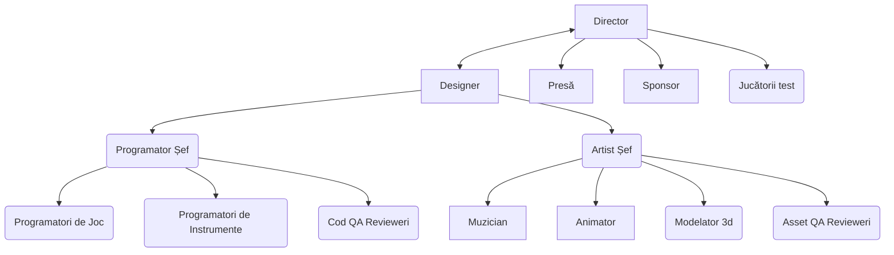

Însă într-un proiect real, cel mai probabil am avea ceva mai haotic.
Cu toate că formal director se află mai sus de designer, iar designer-ul se află mai sus de programatori, într-o echipă reală această ierarhie este mai neclară.
Directorul uneori ar cere un sfat de la programatori, iar muzician ar da feedback la administrarea finanțiară, și aceasta este normal, deoarece fiecare persoană poate să aibă anumite insight-uri într-o problemă pe care chiar un specialist poate nu le observă.

Același lucru se face și cu design-ul jocului. 
Programator / designer / artist au puncte de vedere diferite asupra sistemului, de aceeea observă aspecte diferite ale lui. 
Foarte des un bug devine o funcție, din cauza că programator a observat o interacțiune interesantă, care niciodată nu ar putea fi observată de artist sau designer.

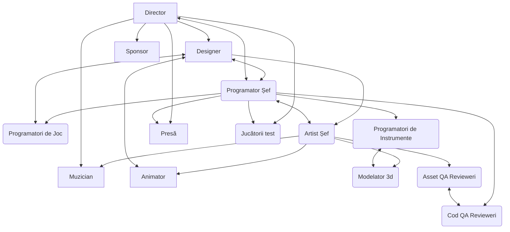

## 3. Argumentarea necesității modernizării sistemului informațional din organizație, prin dezvolatrea sistemului informatic

Prin cuvinte mai simple, tema poate fi exprimată astfel: *de ce să folosim (sau să creăm) un sistem informatic în cadrul organizației, dacă deja avem un model de lucru stabilit?*

Dacă măcar o dată ați lucrat într-o echipă mai mare de două persoane asupra unui joc, sau chiar asupra unui proiect soft, pentru Dvs. trebuie să fie evident de ce instrumentele de control al sursei, o listă de sarcini centralizată și o modalitate de comunicare este indispensabilă.
Deoarece o echipă nu poate funcționa eficient fără aceste instrumente.
Prea mult efort se va pierde la sincronizarea lucrului, la asigurarea că o anumită sarcina nu deja este în procesul implementării de un alt dezvoltator, la build-uri manuale, la căutarea documentării din cauza lipsei unui loc central unde poate fi găsită și căutată.
Coșmarul special ar fi când codul introdus de un dezvoltator previne lucrul la ceilalți. 
Atunci întreaga echipă va fi nevoită să aștepte până când problema nu este rezolvată.
Luând în vedere aceste cauze, precum și multe alte, importanța sistemei centralizate de sincronizare a lucrului devine evidentă.

> Realist, s-ar utiliza așa sistem existent, ca Jira.

### Destinaţia sistemului informatic

Sumarizez:

1. Sistemul informatic va fi un punct central de coordonare a lucrului în echipă, de sincronizarea sarcinilor, de comunicare publică între membrii echipei, de privirea a documentării proiectului ș.a. Vom numi pe scurt **Centrul de administrare a procesului de lucru**.

2. **Utilizatorii** sunt programatorii care vor contribui codul, lăsa review-uri, crea build-urile și documentarea, etc; artiștii care vor citi documentarea și contacta programatorii; managerii care vor putea observa procesul de lucru, desemna sarcini noi, le ajusta pe cele existente, colecta statistici.

3. **Ce probleme vor fi soluţionate la implementarea** (deja am descris).


## 4. Evidențierea utilizatorilor SI și ale funcționalităților oferite acestora

*Enumerarea actorilor și a funcționalităților accesibile lor*: vedeți punctul 2 de mai sus.

*Diagrama de context:*

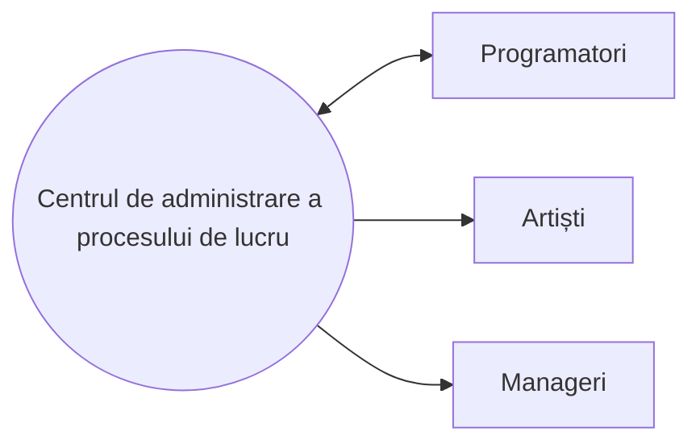


<!-- 

https://yuml.me/diagram/scruffy/class/draw

[Programator]-(Actualizează documentarea)
(Actualizează documentarea)>(Modifică articole)
(Actualizează documentarea)<(Adaugă articole)
[Programator]-(Vizualizează documentarea)
[Programator]-(Dă review la cod)
[Programator]-(Adaugă codul)
[Programator]-(Răspunde la întrebările artiștilor)
[Programator]-(Vizualizează sarcini din Kanban)
[Artist]-(Vizualizează documentarea)
[Artist]-(Pune întrebări programatorilor)
[Artist]-(Vizualizează sarcini din Kanban)
[Manager]-(Vizualizează statistici)
[Manager]-(Vizualizează sarcini din Kanban)
[Manager]-(Adaugă sarcini în Kanban)
[Programator]-(Configurează aplicația)
(Configurează aplicația)<(Configurează conexiunea la bază de date)

-->

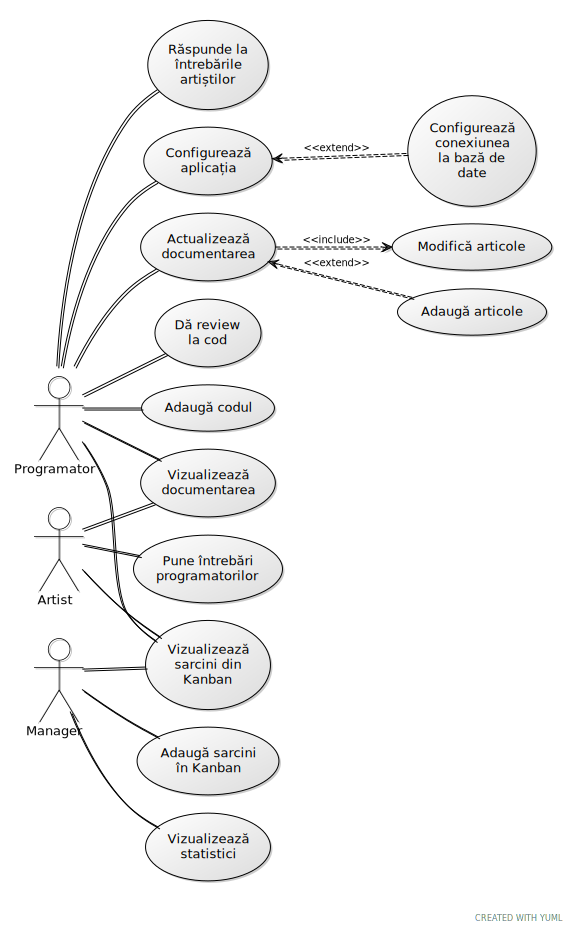


*Unele cerințe funcționale:*

* Posibilitatea vizualizării documentării în mod comod; 
  Posibilitatea de a căuta ușor pagini în care utilizatorul este interesat;
  Posibilitatea de a actualiza documentarea.

* Programatorii trebuie să poată lăsa review la cod; 
  Să adauge codul nou;
  Să configure sistemul;
  Să configure build-uri automatizate.

* Managerii trebuie să aibă o modalitate de a vizualiza statistici, de a înmăna sarcini.

* Kanban centralizat, accesibil de toții membrii echipei.

* Posibilitatea pentru artiști de a lăsa întrebări la programatori, 
  și pentru programatorii să le vizualizeze și să răspundă la ele rapid. 


*Unele cerințe nefuncționale:*

* Aplicația trebuie să fie performantă (cel puțin versiunea desktop), cu un timp de răspuns < 100 ms (în cazul în care nu este limitată de rețea).

* Permisiunele utilizatorilor trebuie să fie configurabile. 
  Minimizarea permisiunelor = minimizarea riscurilor.

* Stările tuturor instanțelor ale sistemului trebuie să fie permanent sincronizate cu baza de date centralizată.

* Aplicația trebuie să suporte autentificarea 2FA.
  Parolele trebuie să fie criptate conform standardelor.

* Nu se permite ca aplicația să cedeze, deoarece aceasta ar previne lucrul întregii echipe.

* Accesibilitatea (daltoniști, persoanele oarbe).


## 5. Modelarea cazurilor de utilizare folosind diagramele activităților și modelarea unor interfețe grafice, specifice cazului de utilizare

1.	Pentru fiecare caz de utilizare evidențiat în lucrarea de laborator anterioară, descrieți-l detaliat, respectând următoarea structură: denumirea cazului de utilizare, actori implicați, descriere succintă, precondiții, postcondiții, scenariul de bază reușit, scenariile alternative pentru cazul de utilizare.
2.	Proiectarea interfețelor grafice specifice fiecărui caz de utilizare.
3.	Modelarea scenariilor grafic, utilizând sintaxa diagramelor activităților din UML.

---

Dacă descriu toate cazurile de utilizare, ar ieși un document pe 100 de pagini, așa că voi descrie doar două.

### Cautarea unui item specific în documentare de către utilizator

<!-- **Denumirea:** Cautarea unui item specific în documentare de către utilizator. -->

**Identificator:** UC001.

**Descrierea:** Un utilizator (artist) intră pe pagina documentării în aplicație pentru a căuta, de exemplu, cum să exporteze modele 3d în joc.

**Actorii**: Utilizatorul, Programatorii.

**Precondiții:** Utilizatorul are un cont, este logat.

**Postcondiții:** Utilizatorul găsește informația care îl interesează.

**Scenariu de bază:**

1. Se începe când utilizatorul dorește să afle informații la o temă specifică (de exemplu, exportarea modelelor 3d în joc).
2. Utilizatorul accesează pagina documentării din aplicație.
3. Utilizatorul scrie întrebarea în câmpul de căutare (de exemplu, *exportarea modelelor 3d*).
4. **[Scenariu alternativ: Utilizatorul configurează filtre de căutare]**
5. Utilizatorul accesează pagina care îl interesează. **[Scenariu alternativ: Utilizatorul nu găsește pagina și cere ajutor de la programatori]**
6. Utilizatorul citește informația de pe pagină pentru a afla ceea ce l-a interesat. **[Scenariu alternativ: Utilizatorul bookmark-ează pagina pentru a reveni la ea mai târziu]**
7. Utilizatorul închide aplicația (sau doar pagina cu documentarea).

**Scenariu alternativ A: Utilizatorul configurează filtre de căutare.**

1. Utilizatorul apasă butonul ce permite configurarea filtrelor.
2. Utilizatorul selectează unele filtre, până când nu își găsește pagina dorită.

**Scenariu alternativ B: Utilizatorul nu găsește pagina și cere ajutor de la programatori.**

1. Utilizatorul intră pe pagina ajutorului imediat.
2. Utilizatorul își scrie întrebarea la programatori.
3. În decurs de un minut, utilizatorul primește răspuns de la programatori.
   Răspunsul ori precizează denumirea / locația paginii de documentare dorite, ori confirmă că pagina nu există.
4. În cazul în care nu există, programatorii îl ajută pe utilizator să-i rezolve problema.

**Scenariu alternativ C: Utilizatorul bookmark-ează pagina pentru a reveni la ea mai târziu.**

1. Utilizatorul apasă iconița de *bookmark*. Prin urma, link-ul la pagină este sălvat în profilul utilizatorului. 


**Interfața de căutare (am luat de pe Google):**

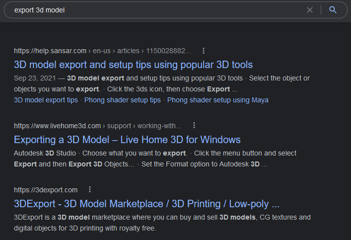

**Aplicarea unui filtru (data modificării, tot de pe Google):**

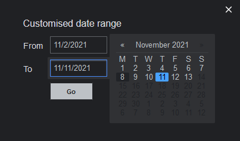

**Întrebarea la programatori (de pe Discord):**

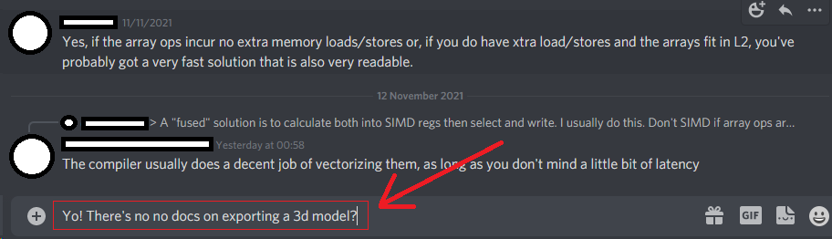

**Bookmark (din Firefox):**

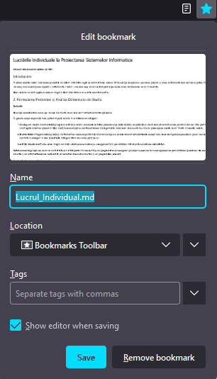


Nu vreau să pierd două ore desenând diagrama online de mână, de aceea folosesc sintaxa [mermaid](https://mermaid-js.github.io/mermaid/#/flowchart) de flowchart-uri (realizez lucrarea în markdown).
Notațiile sunt un pic neconvenționale, însă îmi pare că oricum sunt clare.
Am încercat să fac una și [aici](https://yuml.me/diagram/scruffy/class/draw) ([exemple](https://yuml.me/diagram/scruffy/activity/samples)), dar îmi iese ilizibilă.

Răspunsurile sistemei nu le consider importante (deoarece sunt evidente în fiecare caz), dar ele ar fi și dificile de adăugat (de fapt, ar trebui să desenez manual în program, ceea ce eu nu voi face).

Exemplu: *Introduce întrebarea* evident duce la reacția sistemului *Arată rezultatele potrivite*; *Aplicarea filtrelor* evident duce la *Actualizarea rezultatelor*, etc.

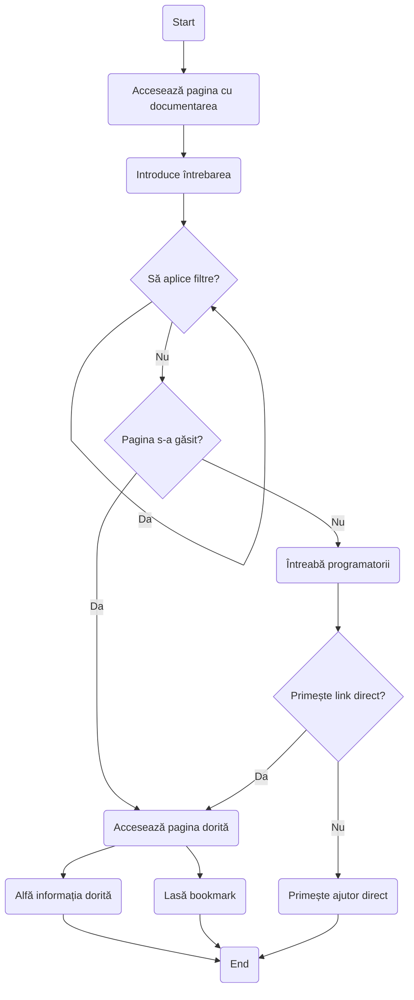


### Vizualizarea statisticilor

**Identificator:** UC002.

**Descrierea:** Un utilizator (manager) intră pe pagina cu statistici și le vizualizează pentru o categorie specifică (de exemplu, numărul de linii de cod adăugate de fiecare programator în ultima lună, sau test coverage).

**Actorii**: Utilizatorul (manager).

**Precondiții:** Utilizatorul are un cont, este logat, are permisiunile de a vizualiza statistici (și de a adăuga sarcini, în cazul scenariului alternativ A).

**Postcondiții:** Utilizatorul vizualizează informații dorite.

**Scenariu de bază:**

1. Scenariul de bază se începe când utilizatorul dorește să vizualizeze statistici după o anumită categorie (zicem, test coverage).
2. Utilizatorul accesează pagina de vizualizare a statisticilor.
3. Utilizatorul selectează categoria dorită din lista categoriilor. **[Scenariu alternativ: Utilizatorul nu găsește categoria dorită]**
4. Utilizatorul selectează parametrile vizualizării (de ex. intervalul de timp, în cazul liniilor de cod).
5. Utilizatorul vizualizează statisticile.
6. Utilizatorul închide aplicație **[Scenariu alternativ: Scenariul se repetă începând de la punctul 3 sau 4]**.

**Scenariu alternativ A: Utilizatorul nu găsește categoria dorită:**

1. Utilizatorul intră pe pagina ajutorului din partea programatorilor.
2. Utilizatorul întreabă, cât de dificil ar fi de adăugat categoria ce lipsește în meniu.
3. Utilizatorul gândește dacă pierderea timpului a unui din programatori la această sarcină merită.
4. În dependența de decizie din punctul 3, utilizatorul ori decide că nu merită, și nu vizualizează statistică dată, 
   ori creează o sarcină nouă, plasând-o pe Kanban, ori atribuind-o unui din programatori liberi.

**Interfața: numărul linii de cod modificate de fiecare programator (de pe Github):**

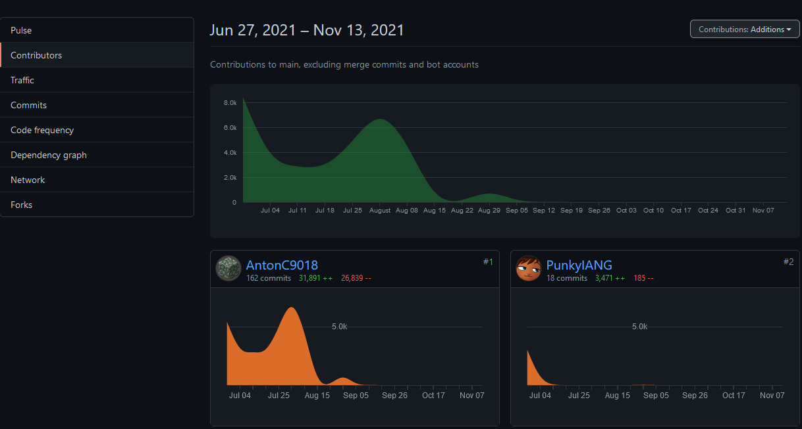

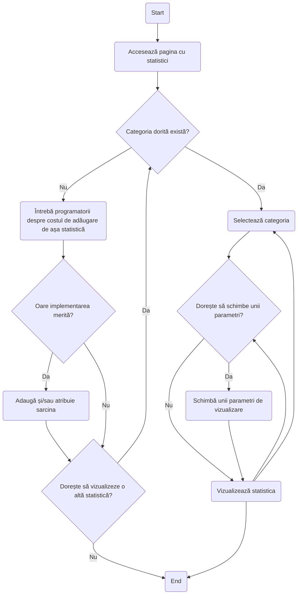


## 6. Elaborarea modelului domeniului și evidențierea claselor conceptuale

1.	Evidențierea noțiunilor domeniului și găsirea claselor conceptuale.
2.	Evidențierea relațiilor de asociere dintre clasele conceptuale.
3.	Evidențierea atributelor claselor conceptuale.
4.	Construirea modelului domeniului.

---

1. Utilizatorul poate avea unul sau mai multe roluri: programator, manager, artist.
   Utilizatorul are un set de permisiuni, inclusiv în dependența de rol.
   
   Obiectele: **Utilizator**.

   Atributele: **roluri/permisiuni**.

2. Utilizatorul poate accesa pagina cu documentarea, unde poate căuta un articol concret, introducând întrebarea și selectând filtre.

   Obiectele: **Pagina cu documentarea, Interogarea, Articol, (Baza de date?)**.

   Atributele: **boxa de căutare, dropdown cu filtrele, filtrele selectate, numele introdus, rezultate cautării**.

3. Utilizatorul poate pune întrebări la programatori.
   Programatorii pot să răspundă la întrebări.

   Obiectele: **Pagina cu întrebări, Întrebare, Răspuns**.

   Atributele: **categoria, textul întrebării, textul răspunsului, referințe la thread-uri de discuție**.

4. Utilizatorul poate vizualiza statistici.

   Obiectele: **Pagina cu statistici**.

   Atributele: **categoria, modul de vizualizare, parametrile vizualizării, zona de desenare**.

5. Utilizatorul poate accesa kanban.

   Obiectele: **Pagina cu Kanban, sarcina**.

   Atributele: **grupul de sarcini, metadatele sarcinii (utilizatorii cui este atribuită sarcină, comentariile, istoria progresului, descrierea)**.

6. Utilizatorul poate configura devop-urile: build-urile, testarea automată, generarea documentării etc;
   Poate customiza global aplicația.

   Obiectele: ???

   Atributele: ???

etc. etc.


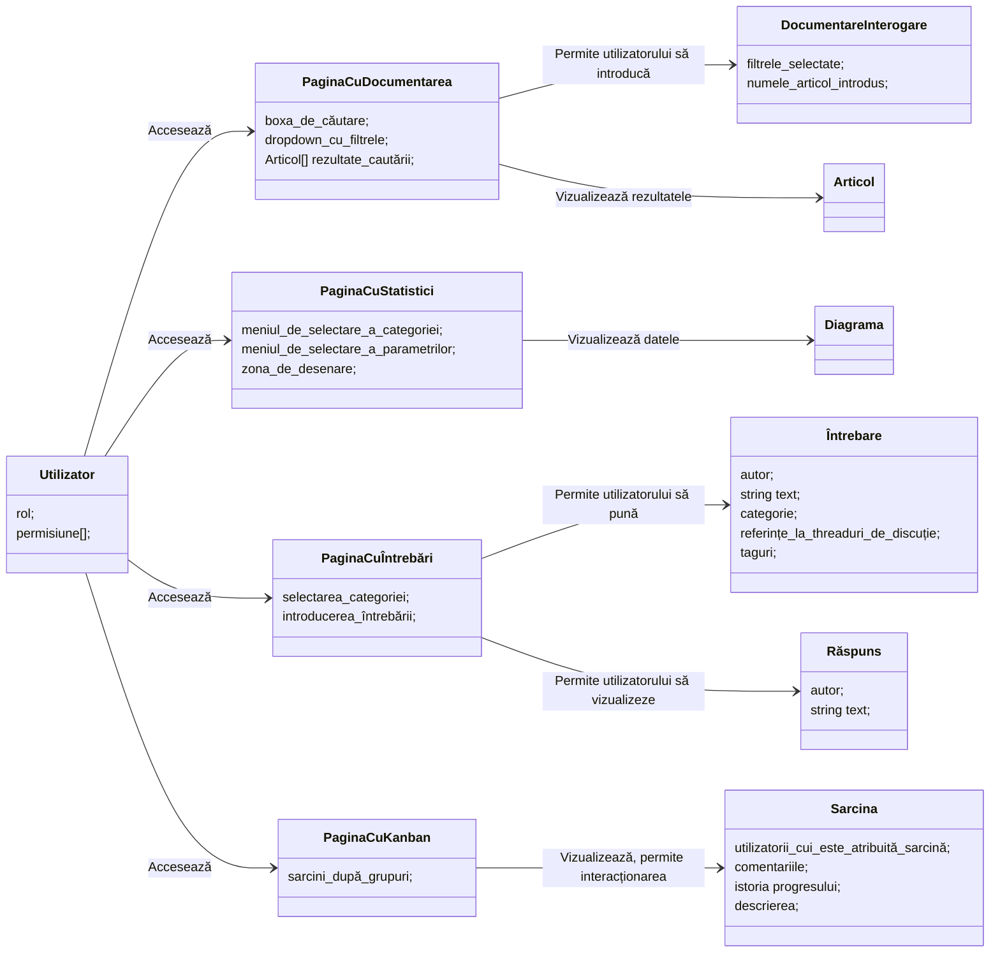


## 7. Modelarea interacțiunii dintre obiectele domeniului. Evidențierea responsabilităților obiectelor domeniului.

| Utilizator (artist)                      | Sistem                                                            |
|------------------------------------------|-------------------------------------------------------------------|
| 1. Deschide pagina documentării          | 2. Afișează pagina documentării                                   |
| 3. Scrie întrebarea în câmpul de căutare | 4. Performă căutarea în baza de date                              |
|                                          | 5. Afișează rezultatele cautării                                  |
| 6. Selectează filtre                     | 7. Aplică rezultatele cautării, actualizează rezultatele          |
| 8. Deschide unul dintre articole         | 9. Afișează conținutul articolului                                |
| 10. Bookmark-ează articolul              | 11. Salvează faptul că articolul este bookmark-at în baza de date |


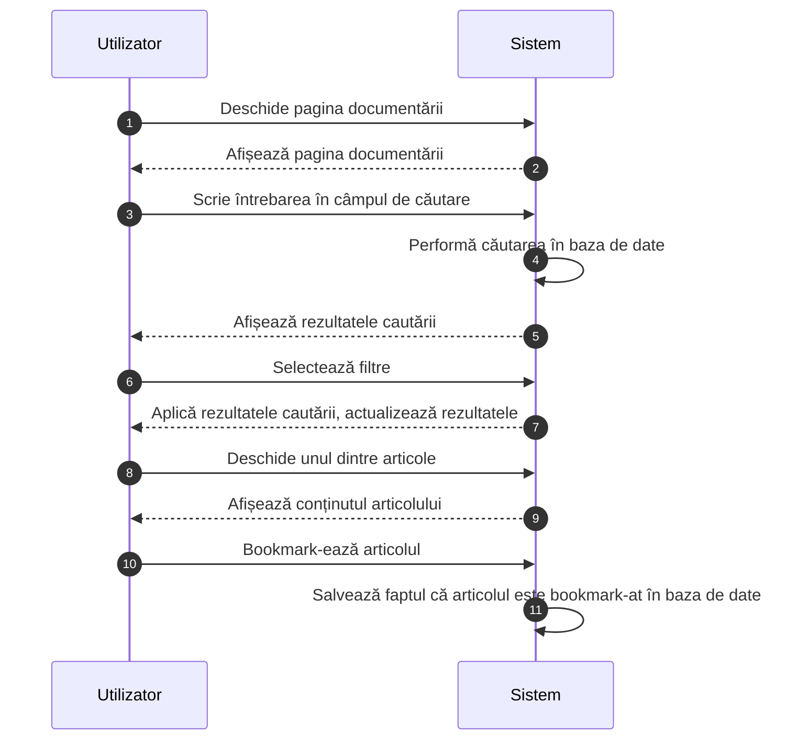

### Descrierea operațiilor de sistem

Mai jos, prin *baza de date* am în vedere *sursa centralizată datelor*, poate fi un API, sau conectarea directă la o bază de date.

---

**Operația:** `Deschide_pagina_documentării()`

**Trimiteri la cazul de utilizare**: Cautarea unui item specific în documentare de către utilizator

**Precondiții**: -

**Postcondiții**: 

- A fost creat (încărcat leneș) un exemplar pentru `Pagina_Documentării`;
- Pagina curentă este resetată la acest exemplar;
- Interfața grafică de utilizator a fost inițializată (leneș, adică dacă utilizatorul a accesat pagina dată în trecut, ea rămâne în starea în care utilizatorul a lăsat-o);
- Datele utilizate de către interfața au fost actualizate (în cazul în care ceva s-a schimbat în bază de date).

---

**Operația:** `Scrie_întrebarea_în_câmpul_de_căutare()`

**Trimiteri la cazul de utilizare**: Cautarea unui item specific în documentare de către utilizator

**Precondiții**: Pagina curentă este un exemplar al `Pagina_Documentării`

**Postcondiții**: 

- Boxa de căutare conține întrebarea introdusă;
- Interogarea a fost actualizată utilizând textul întrebării, și a fost trimisă la baza de date;
- Baza de date a răspuns cu o listă de articole potrivite cautării; 
- Lista de articole a fost actualizată să afișeze articole relevante cautării.

---

**Operația:** `Selectează_filtre()`

**Trimiteri la cazul de utilizare**: Cautarea unui item specific în documentare de către utilizator

**Precondiții**: 

- Pagina curentă este un exemplar al `Pagina_Documentării`

**Postcondiții**: 

- Filtrele aplicate au fost actualizate;
- Interogarea a fost actualizată conform filtrelor selectate și a fost transmisă la baza de date;
- Baza de date a răspuns cu o listă de articole potrivite cautării; 
- Lista de articole a fost actualizată să afișeze articole relevante filtrelor și a întrebării (în cazul în care întrebarea lipsește, căutarea este executată doar conform filtrelor, dacă posibil).

---

**Operația:** `Deschide_unul_dintre_articole()`

**Trimiteri la cazul de utilizare**: Cautarea unui item specific în documentare de către utilizator

**Precondiții**: 

- Pagina curentă este un exemplar al `Pagina_Documentării`;
- Pagina deja arată unele articole potrivite interogării.

**Postcondiții**: 

- Pagina a trimis o interogare la baza de date, cerând textul întreg al articolului;
- Baza de date a răspuns cu textul articolului;
- Pagina și-a schimbat starea să afișeze articolul selectat (deci boxa de căutare și filtrele deja nu sunt vizibile).


---

**Operația:** `Bookmark_articol()`

**Trimiteri la cazul de utilizare**: Cautarea unui item specific în documentare de către utilizator

**Precondiții**: 

- Pagina curentă este un exemplar al `Pagina_Documentării`;
- Pagina este în starea unde se afișează textul complet al articolului selectat.

**Postcondiții**: 

- Pagina a trimis o interogare la baza de date, în urmă cărei baza de date a adăugat ID-ul paginii în lista paginilor bookmark-ate a utilizatorului dat;
- Utilizatorul a primit un indicator vizual că articolul a fost bookmark-at cu succes.


## 8. Descrierea soluțiilor tehnice în baza operațiilor de sistem. Construirea diagramei claselor de programare. Adăugarea atributelor și a metodelor claselor

1.	Pentru fiecare operație de sistem să se construiască diagrama de interacțiune, care prezintă ”modelarea dialogului dintre obiectele domeniului”.
2.	Elaborarea soluțiilor de proiectare pentru fiecare operație de sistem.
3.	Construirea diagramei claselor.

În cazul descris mai sus, am de fapt doar un obiect (pagina de documentare) + serviciul bazei de date.
Ați putea zice că interogarea tot este un obiect, și filtru tot este un obiect, însă le-aș considera doar conținutul (structura) mesajelor transmise între pagina documentării și serviciul bazei de date.
Articolul tot nu-l consider un obiect: este simplu text care a venit de la baza de date și care este afișat pe ecran.
După opinia mea, nu are sens să-l considerăm un "obiect", deoarece reprezintă pur și simplu niște date.

Însă utilizatorul... Este un actor, nu-i obiect. 
Da, el are niște date legate la el, însă nu are sens să-l reprezentăm iarăși ca un "obiect".

Pagina de documentare poate fi considerată ca un obiect, dacă vrem foarte mult să facem aceasta.
Ea comunică cu alte obiecte (baza de date) și primește semnale de la utilizator, deci este asemănătoare cu un obiect.

Dacă modelăm acest sistem cu mai multe "obiecte", sporim fără rost complexitatea. 
(Ca în exemplu prezentat, ceea ce-s datele Dvs. modelați ca obiecte, ceea ce face ca sistemul să pară mai complicat decât este în realitate.)

Eu nu văd unde o diagramă de comunicare poate fi utilă în sistemul meu?
Mai sus, în lucrarea 7, vedeți diagrama de comunicare. 
Sistemul meu nu poate fi mult mai complicat decât pe acea diagramă.

Mai jos, adaug în diagrama serviciul bazei de date. 
Baza de date (de fapt sursa de date, cum s-a menționat anterior) în acest caz este o abstracție utilă, deoarece datele pot veni de la mai multe locuri: o bază de date locală test, un API endpoint, o conexiune directă la o bază de date a companiei, poate fi luată de la un fișier, poate fi cachată.

În contrast, abstractizarea unui articol într-un obiect independent nu este util, deoarece articolele din documentare sunt unii și aceeași, și pot fi păstrate ca simplu date structurate. 
Cel mult poate exista ca un obiect o pagină de vizualizare a unui articol. 

Deci, după opinia mea, gândirea în termeni de obiecte în timpul proiectării... rar este utilă.


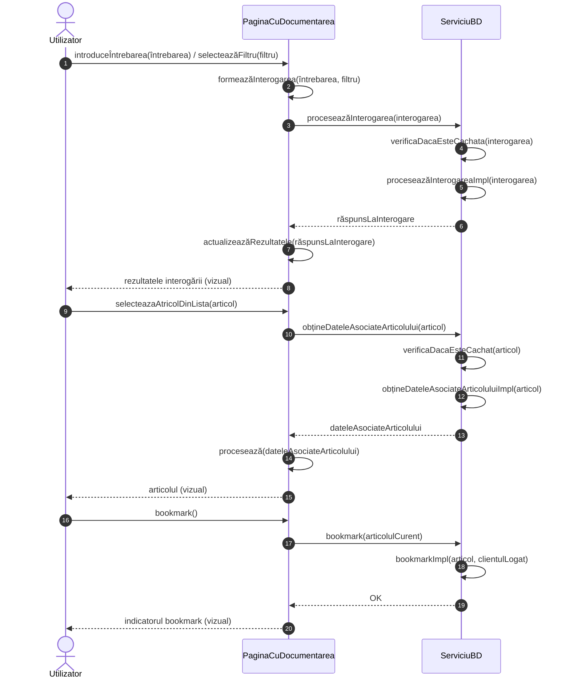

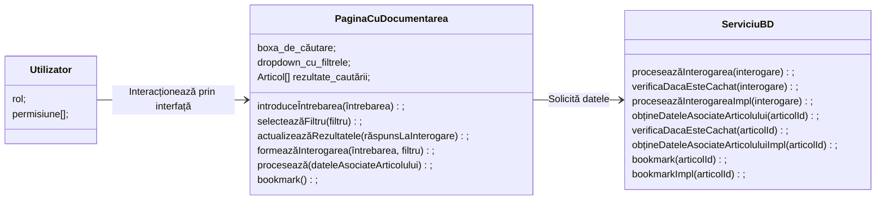

Metodele Impl pot să fie injectate ca delegate membru, ori pot fi simulate ca metode abstracte, ori poate fi folosit un obiect `BDImpl` care ar defini aceste metode și ar incapsula totul necesar pentru funcționarea lor.

Cum s-a explicat anterior, nu văd sensul să mai adaug obiecte, deoarece sunt simplu datele, și doar ar complica sistemul.
Diagrama dată în exemplu este supraîncărcată cu metode nesemnificative și multiple obiecte care de fapt sunt simplu date structurate care conceptual nu trebuie să aibă nici o metodă.


## 9. Planificarea iniţială a proiectului SI.

**Formularea obiectivelor principale ale proiectului.**

Crearea unui sistem de administrare a echipei și a dezvoltării care ulterior poate fi utilizat pentru ușurarea dezvoltării în alte proiecte.

**Fixarea datelor generale ale proiectului (denumirea, autorul etc.).**

??

**Definirea graficului de activitate a echipei proiectului. Abateri de la calendarul standard (dacă este necesar).**

Standard: 5 zile de muncă, 2 zile de odihnă.

**Specificarea listei de activităţi necesare a fi realizate pentru dezvoltarea SI (pot fi grupate în procese, etape).**

1. Determinarea grupei de funcționalități esențiale care vor fi implementate inițial. 
   Aceasta ar fi clară pentru dezvoltatorii din start (documentația, Kanban, și altele lucruri descrise anterior).
2. Implementarea funcționalității inițiale.
3. Utilizarea sistemului în scopul unui alt proiect, inițiat de aceeași companie.
   Culegerea feedback-ului de la persoanele care lucrează cu sistemul, precum înșiși programatori, artiști, manageri.
4. Implementarea funcționalităților cerute de la aceste persoane, eliminarea punctelor slabe sau perfectarea punctelor necomode (perfectarea interfeței).
5. Perfectarea sistemului, optimizarea design-ului, pentru a atinge performanța sistemului mai bună.
   Acest sistem va fi utilizat de multe persoane, deci performanța este importantă (nu vrem să pierdem timpul persoanelor care încerc să lucreze).

Prin perfectarea sistemului am în vedere următoarele:
- eliminarea bug-urilor, 
- refactoring-ul subsistemelor, 
- asigurarea performanței mare stabile, 
- documentarea proiectului, 
- scrierea testelor.

**Fixarea datelor de început şi sfârşit ale activităţilor, determinarea duratelor activităţilor.**

1. ~ 2 zile.
2. ~ 1 lună.
3. și 4. și 5. Întreaga existență a sistemului.

**Specificarea necesarului de resurse pentru realizarea proiectului (umane, materiale, tehnice, de tip cost).**

O echipă de 3-4 programatori experiențați. 
Poate un server proprietar unde va fi instalată baza de date (aș presupune că ar fi mai comod astfel decât pe cloud, + dacă serverul este instalat în scopul intreprinderii, trebuie să fie mai rapid).

**Alocarea/repartizarea de resurse fiecărei activităţi.**

??


**Calcularea cheltuielilor proiectului (a bugetului).**

Salariul pentru programatori X numărul de programatori X cât timp vor lucra.

Costurile serverului local (sincer n-am idei cât costă menținerea unui server), ori servicii băzate pe cloud (adică AWS).


**Stabilirea relaţiilor dintre activităţi. Construirea diagramei de tip reţea (PERT).**

N-am realizat-o.

**Construirea diagramei Gantt.**

```mermaid
gantt

title Diagrama Gantt pentru proiect
dateFormat  YYYY-MM-DD


section Planificare
Determinarea funcționalităților inițiale :determineInitialFunctions, 2021-12-05, 2d

section Implementarea inițială
Setarea serverului local (sau unui cloud server AWS) : 2021-12-07, 30d
Setarea frontendului                                 : 2021-12-07, 30d
Setarea bazei de date                                : 2021-12-07, 30d
Setarea autentificării utilizatorului                : 2021-12-07, 30d
Setarea logicii pe backend                           :setupLogic, 2021-12-07, 30d
MVP : milestone, mvp, 2022-02-07

section Perfectarea
Culegerea feedback-ului           : 2022-01-07, 2d
Implementarea noilor capacități   : 2022-01-09, 10d
Perfectarea sistemului            : 2022-01-19, 40d
```

<!-- The MVP : milestone, mvp, 2022-02-07 thing is bugged, it should be 2022-01-07, but then it displays incorrectly -->
<!-- The :after thing is bugged too, maybe I should up the mermaid version in the template -->


**Gestiunea resurselor (monitorizarea repartizării corecte a resurselor corespunzător activităţilor).**

Se cumpără o mașină pentru server. 
Cerințele mai specifice vor depinde de proiect în scopul căreia va fi utilizat sistemul.
